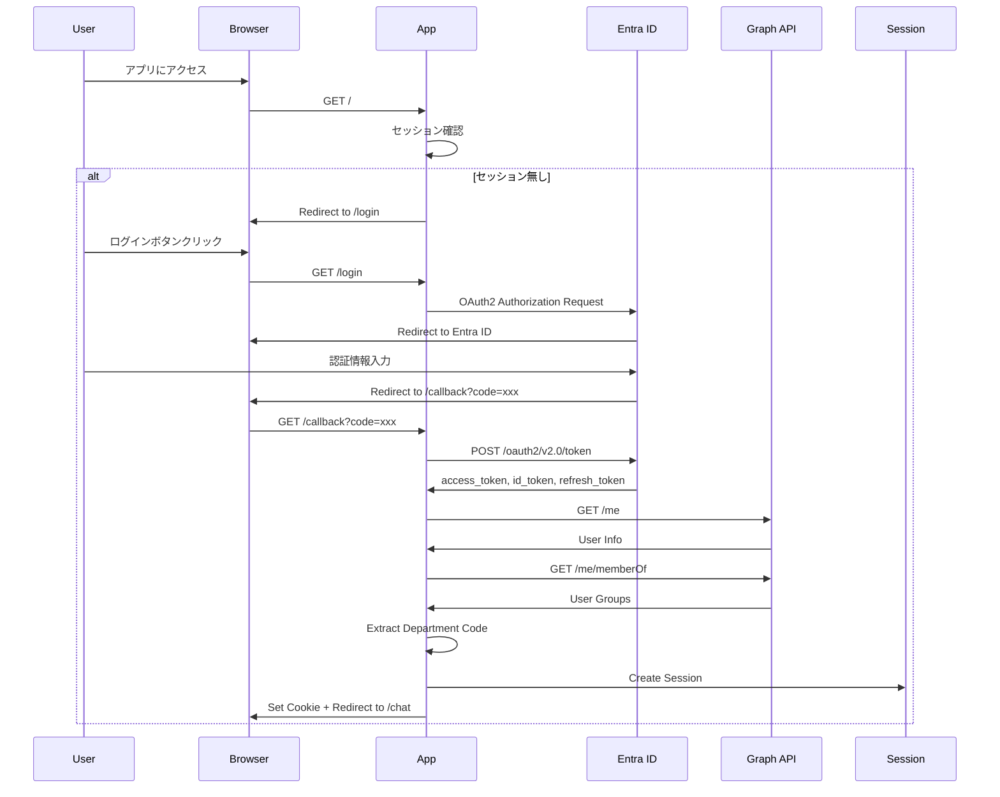

# 認証設計

このドキュメントでは、Microsoft Entra ID (旧 Azure AD) を使用した認証フローとGraph API連携について説明します。

---

## 認証フロー概要

### 認証方式
- **Identity Provider**: Microsoft Entra ID
- **認証プロトコル**: OAuth 2.0 / OpenID Connect
- **フロー**: Authorization Code Flow
- **組織情報取得**: Microsoft Graph API

---

## 認証シーケンス



---

## Azure Portal設定

### アプリ登録

1. **Azure Portalにアクセス**
   - https://portal.azure.com

2. **アプリケーションの登録**
   - `Azure Active Directory` → `アプリの登録` → `新規登録`
   - **名前**: `社内RAG検索チャットボット`
   - **サポートされるアカウントの種類**: `この組織ディレクトリのみ`
   - **リダイレクトURI**: 
     - プラットフォーム: `Web`
     - URI: `https://your-app.azurewebsites.net/callback`

3. **クライアントシークレットの生成**
   - `証明書とシークレット` → `新しいクライアントシークレット`
   - **説明**: `App Client Secret`
   - **有効期限**: `24か月` (推奨)
   - 生成されたシークレットを **即座にコピー** (後で確認不可)

4. **APIのアクセス許可**
   - `APIのアクセス許可` → `アクセス許可の追加`
   - **Microsoft Graph** → **委任されたアクセス許可**
   - 以下のアクセス許可を追加:
     - `User.Read` (ユーザー情報の読み取り)
     - `GroupMember.Read.All` (グループメンバーシップの読み取り)
   - `管理者の同意を付与` をクリック

5. **アプリケーションIDの取得**
   - `概要` タブから以下をコピー:
     - **アプリケーション (クライアント) ID**
     - **ディレクトリ (テナント) ID**

---

## Entra IDグループ設定

### グループ命名規則

所属コードを含むグループ名を作成します。

**形式**: `{PREFIX}_{CODE}_{NAME}`

**例**:
- `DEPT_001_営業部`
- `DEPT_002_技術部`
- `DEPT_003_管理部`

### グループ作成手順

1. **Azure Portal**
   - `Azure Active Directory` → `グループ` → `新しいグループ`

2. **グループ情報**
   - **グループの種類**: `セキュリティ`
   - **グループ名**: `DEPT_001_営業部`
   - **グループの説明**: `営業部の従業員`

3. **メンバーの追加**
   - 所属する従業員を追加

---

## 認証フロー実装

### 1. Entra IDクライアント

```typescript
// app/lib/auth/entra-client.ts
import { ConfidentialClientApplication } from '@azure/msal-node';
import { env } from '~/lib/utils/env';

// MSAL設定
const msalConfig = {
  auth: {
    clientId: env.ENTRA_CLIENT_ID,
    authority: `${env.ENTRA_AUTHORITY}/${env.ENTRA_TENANT_ID}`,
    clientSecret: env.ENTRA_CLIENT_SECRET,
  },
};

const msalClient = new ConfidentialClientApplication(msalConfig);

/**
 * OAuth2認証URL生成
 */
export function getAuthorizationUrl(): string {
  const authCodeUrlParameters = {
    scopes: ['User.Read', 'GroupMember.Read.All'],
    redirectUri: env.ENTRA_REDIRECT_URI,
  };

  return msalClient.getAuthCodeUrl(authCodeUrlParameters);
}

/**
 * Authorization Code → Tokens
 */
export async function exchangeCodeForTokens(code: string) {
  const tokenRequest = {
    code,
    scopes: ['User.Read', 'GroupMember.Read.All'],
    redirectUri: env.ENTRA_REDIRECT_URI,
  };

  const response = await msalClient.acquireTokenByCode(tokenRequest);

  return {
    accessToken: response.accessToken,
    refreshToken: response.refreshToken,
    idToken: response.idToken,
    expiresIn: response.expiresOn 
      ? Math.floor((response.expiresOn.getTime() - Date.now()) / 1000) 
      : 3600,
  };
}

/**
 * リフレッシュトークンで新しいアクセストークン取得
 */
export async function refreshAccessToken(refreshToken: string) {
  const tokenRequest = {
    refreshToken,
    scopes: ['User.Read', 'GroupMember.Read.All'],
  };

  const response = await msalClient.acquireTokenByRefreshToken(tokenRequest);

  return {
    accessToken: response.accessToken,
    refreshToken: response.refreshToken,
    expiresIn: response.expiresOn 
      ? Math.floor((response.expiresOn.getTime() - Date.now()) / 1000) 
      : 3600,
  };
}
```

### 2. Graph APIクライアント

```typescript
// app/lib/graph/graph-client.ts
import { Client } from '@microsoft/microsoft-graph-client';

/**
 * Graph APIクライアント作成
 */
export function createGraphClient(accessToken: string): Client {
  return Client.init({
    authProvider: (done) => {
      done(null, accessToken);
    },
  });
}
```

### 3. ユーザーサービス

```typescript
// app/lib/graph/user-service.ts
import { createGraphClient } from './graph-client';
import type { GraphUser, DepartmentInfo } from '~/types/graph';
import { env } from '~/lib/utils/env';

/**
 * ユーザー情報取得
 */
export async function getUserInfo(accessToken: string): Promise<GraphUser> {
  const client = createGraphClient(accessToken);
  return await client.api('/me').get();
}

/**
 * 所属部署情報取得
 */
export async function getUserDepartment(
  accessToken: string
): Promise<DepartmentInfo | null> {
  const client = createGraphClient(accessToken);
  const response = await client.api('/me/memberOf').get();

  const prefix = env.GRAPH_DEPARTMENT_GROUP_PREFIX; // "DEPT_"
  const departmentGroup = response.value.find((group: any) =>
    group.displayName?.startsWith(prefix)
  );

  if (!departmentGroup) {
    return null;
  }

  // "DEPT_001_営業部" → ["DEPT", "001", "営業部"]
  const parts = departmentGroup.displayName.split('_');
  
  if (parts.length < 2) {
    return null;
  }

  return {
    code: parts[1],  // "001"
    name: parts.slice(2).join('_'),  // "営業部"
    groupId: departmentGroup.id,
    groupName: departmentGroup.displayName,
  };
}
```

---

## セキュリティ考慮事項

### トークン管理

1. **アクセストークン**
   - サーバーサイドセッションに保存
   - クライアントに送信しない
   - 有効期限を確認して自動更新

2. **リフレッシュトークン**
   - セッションに安全に保存
   - HTTPS通信のみ
   - 定期的なローテーション

3. **セッション**
   - Secure Cookie (HTTPOnly, SameSite)
   - セッションID は暗号学的に安全な乱数
   - セッションタイムアウト: 24時間

### アクセス制御

1. **所属コード検証**
   - 全リクエストで所属コードを確認
   - 不正なアクセスをブロック

2. **トークン検証**
   - 有効期限の確認
   - トークン署名の検証

3. **レートリミット**
   - 1分間に30リクエスト
   - 過度なAPIコールをブロック

---

## トラブルシューティング

### エラー: "AADSTS50011: The reply URL ... does not match"

**原因**: リダイレクトURIが一致しない

**解決策**:
1. Azure PortalでリダイレクトURIを確認
2. `.env`ファイルの`ENTRA_REDIRECT_URI`と一致させる
3. Azure Portalでリダイレクト URIを追加

### エラー: "Insufficient privileges to complete the operation"

**原因**: APIアクセス許可が不足

**解決策**:
1. Azure Portal → アプリの登録 → APIのアクセス許可
2. `User.Read`, `GroupMember.Read.All`を追加
3. 管理者の同意を付与

### エラー: "所属部署が見つかりません"

**原因**: ユーザーが適切なグループに所属していない

**解決策**:
1. Azure Portal → グループで所属確認
2. `DEPT_`プレフィックスのグループに追加
3. グループ名が正しい形式か確認 (`DEPT_001_営業部`)

---

**関連ドキュメント:**
- [環境変数設定](./02_環境変数設定.md)
- [セッション管理](./05_セッション管理.md)
- [実装ガイド Phase 1](./08_実装ガイド_Phase1.md)

**最終更新**: 2025年11月
